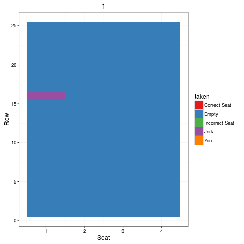

# Will Someone Be Sitting In Your Seat On The Plane?
Dan Schlauch  
02/19/2016  


[From The Riddler at fivethirtyeight.com](http://fivethirtyeight.com/features/will-someone-be-sitting-in-your-seat-on-the-plane/)

*There’s an airplane with 100 seats, and there are 100 ticketed passengers each with an assigned seat. They line up to board in some random order. However, the first person to board is the worst person alive, and just sits in a random seat, without even looking at his boarding pass. Each subsequent passenger sits in his or her own assigned seat if it’s empty, but sits in a random open seat if the assigned seat is occupied. What is the probability that you, the hundredth passenger to board, finds your seat unoccupied?*

***

There are really only two seats to think about here.  (1) Your own seat and (2) the Jerk's seat.  

If Jerk randomly chooses his own seat, then all is right in the world and everyone gets their own seat.  If Jerk chooses your seat, it's over and you will have to sit elsewhere.  Of course most likely he will choose one of the other 98 seats, but this doesn't change anything going forward.  When it comes time for that poor passenger to sit, he is also faced with the same scenario that Jerk faced - (1) he picks Jerk's seat and all is well going forward, (2) he picks your seat (3) he passes the buck along to some other poor passenger.  

With this formulation it's clear that you simply need someone to sit in Jerk's seat before someone sits in your seat.  Since there is no difference between the seats, the size of the plane does not matter - the answer is clearly 50/50.

***


 

***

**Extra credit**

*Instead of being last out of 100, the airline decides to randomly choose passengers to board the plane.  The Jerk was still able to get on first (he's a platinum-diamond member, obviously), but everyone else has to wait until they're called and then board the plane.  What is the probability of getting your seat now?*

***

Well, we already figured out that the probability was 1/2 for the person who boards last.  But for the rest it's a bit more complicated.  

Number the passengers from $1,2\dots 100$ based on the order that they are called to board, but call the Jerk #100 even though he boards first.  When Jerk picks seat $n$, all the passengers from $1$ to $(n-1)$ get their own seat.  Then passenger $n$ must choose the seat of a later passenger.  

When we look at the problem this way, we can see that this always means that if someone picks the seat of passenger who is later than you in the line *before* your seat is picked, you will get your own seat.  

The ideal scenario is that Jerk picks the seat for passenger #100 (his own seat), which would mean everyone gets their seat.  

For the $n^{th}$ to last passenger to board (that's passenger #(100-$n$)), there are $n$ seats behind her (including the Jerk's seat), so that means that the probability of getting her own seat is $\frac{1}{1+n}$.

So, summing over the 99 non-Jerks we have $$\bar{X} = \frac{1}{99} \sum_{i=1}^{99} \frac{1}{1+i}$$


```r
mean(1/(1+1:99))
```

```
## [1] 0.04229674
```

There is a **4.23%** chance that you, a non-jerk, will have someone in your seat.
