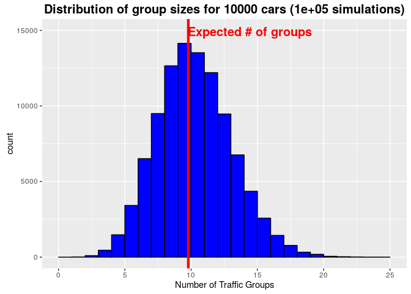
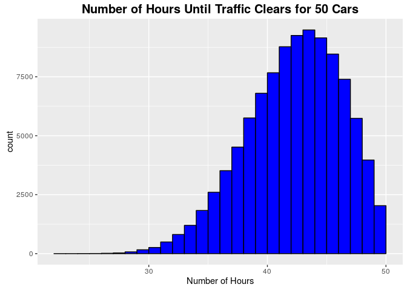

# How Many Cars Will Get Stuck In Traffic?
Dan Schlauch  
02/05/2016  


[From The Riddler at fivethirtyeight.com](http://fivethirtyeight.com/features/how-many-cars-will-get-stuck-in-traffic/)

First, counting the number of groups in a given set of cars is straightforward.  First find the slowest overall car and call all the cars behind it the first group.  Then look at all the cars in front of that car and find the slowest of those remaining cars.  The cars behind it but in front of the first group form the second group, and so on...  

This is solved with the following recursive function.


```r
numberOfGroupedVehicles <- function(vehicles, counter){
  if(length(vehicles)==0)
    return(counter)
  numberOfGroupedVehicles(vehicles[-1:-which.min(vehicles)], counter+1)  
}
```

Initially, I thought that log2 would yield the expected number of traffic groups, which would be the case if the slowest car in each group was always found in the middle.  But it turns out that this overestimates the number of congestions because having the slowest car towards the rear increases the number of groups less than the amount that having that same car towards the front decreases the number of groups.  In other words, on average having the slowest remaining car randomly placed is **worse** for traffic than having it always in the middle.

Instead we have to calculate the expected number of groups from *n* cars by summing the expected number of groups for each of the *n* possible locations of the slowest remaining car- which, of course, depends on the summ the expected number of groups for each of the possible locations for the next slowest remaining car... and so on.

We can use induction here.  Consider a known expected number of groups for *n* cars.  Now think about *n+1* cars.  There is a *1/(n+1)* chance that the slowest car is in the rear, and a *n/(n+1)* chance that it is not.  If it is in the rear, we simply add 1 to the expected traffic groups, and then we are left with *n* cars. If it is not in the rear, the number of expected traffic groups remaining is exactly the same as for *n* cars.

So, we can see that $$f(x)=f(x-1)+\frac{1}{x}$$

And, by induction, using the fact that 1 car yields 1 traffic group $$f(1)=1$$ we can calculate the expected number of traffic groups.


```r
expectedGroups <- function(n) sum(1/(1:n))
```

Now, running 100,000 simulations each involving 10,000 cars we see that the calculated expectation matches the mean number of traffic groups.


```r
numVehicles <- 10000
numSimulations <- 100000
groupSizes <- replicate(numSimulations,numberOfGroupedVehicles(sample(numVehicles), 0))
meanGroups <- mean(groupSizes)
meanGroups
```

```
## [1] 9.77159
```

```r
numExpectedGroups <- expectedGroups(numVehicles)
numExpectedGroups
```

```
## [1] 9.787606
```

For 10,000 cars, the expected number of traffic groups is 9.787606



***

**Extra credit**

Every hour, the leader of each group of cars looks into the mirror.  Upon noticing the traffic built up behind them, they pull over and let the group pass them before continuing on the road.  How many hours will need to pass before the *n* cars are all unobstructed?

***

It helps to recognize a couple things here:

(1) Every car can advance forward at most one space per hour and never stays put until they have reached their true position (only faster cars are ahead and only slower cars are behind).

(2) For any car that pulled over at any time, there exists a car which never pulled over that took as long or longer to reach its true position.


Of these, (1) may be intuitive, but (2) requires a little reasoning.  Consider a car (lets call it car A) which is forced to pull over.  That means that each of the cars that were held up in their traffic group are faster than it.  Now think about the rear of that traffic group (car B).  Car B will be faster than Car A, and yet Car B will be only 1 spot ahead of Car A after Car A merges back onto the road.  At best, Car B and Car A can reach their final positions at the same time, but in no scenario can car B get there before car A.  

With that in mind, we only have to look for cars which only moves forward in the line to find the maximum time until no traffic exists.  Remembering that cars can only move forward at most 1 spot each hour, that means we simply find the car that starts the greatest distance in line behind it's ending position.


```r
numVehicles <- 50
hours <- replicate(100000,  max(sample(numVehicles)-(1:numVehicles)))
ggplot(data.frame(hours=hours), aes(hours, col="blue")) + geom_histogram(color="black",binwidth=1,fill=I("blue")) + 
        ggtitle(paste0("Number of Hours Until Traffic Clears for ", numVehicles, " Cars")) + 
        theme(plot.title = element_text(size=15, face="bold")) +
        xlab("Number of Hours")
```



```r
mean(hours)
```

```
## [1] 41.73954
```
For 50 cars, the average number of hours until traffic clears is 41.73954 hours
